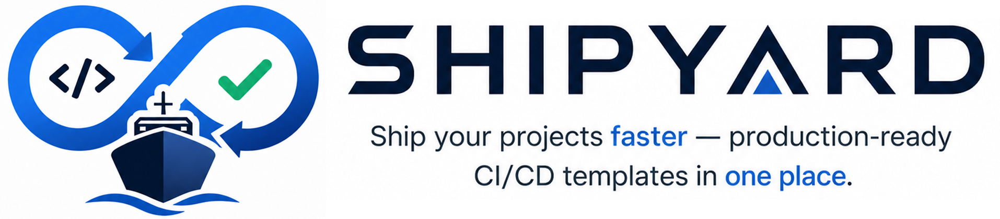

**ShipYard** is a standardized deployment template set for VPS environments using Docker, Traefik, and reusable CI/CD workflows.


> Built on a production-ready cloud-native stack
>
> <h4 align="center">
   <p align="center" style="display: flex; justify-content: center; align-items: center; flex-wrap: wrap; gap: 15px;">
  
  
  
  
  
</p>

> </h4>


## Overview

This repository centralizes deployment logic in shell scripts under `scripts/` and keeps CI providers as lightweight orchestrators.

Supported CI providers:
- GitHub Actions
- CircleCI

## Architecture

- Runtime deployment logic: `scripts/`
- Reusable GitHub workflows: `.github/workflows/`
- Reusable CircleCI configuration: `.circleci/`
- Starter templates for new services: `templates/`

This separation keeps deployment behavior consistent across CI platforms and reduces maintenance overhead.

## Required Secrets

At minimum, configure the following repository secrets:

- `SSH_PRIVATE_KEY`
- `SERVER_IP`
- `ENV_FILE_CONTENT`
- `TELEGRAM_BOT_TOKEN`
- `TELEGRAM_CHAT_ID`

### `ENV_FILE_CONTENT` metadata

`ENV_FILE_CONTENT` should contain your environment variables and include these deployment keys:

| Variable | Description | Required | Default |
| :--- | :--- | :---: | :--- |
| `APP_NAME` | Application identifier used for image/deploy naming | Yes | N/A |
| `APP_DOMAIN` | Public domain for routing and notifications | No | Empty |
| `APP_PORT` | Internal application port on the target host | Yes | `80` |
| `HEALTH_CHECK_PATH` | Endpoint path used after deployment | No | `/` |

## Reusable Workflow Parameters

When using `templates/cd.yml`, you can override values with `with:`.

| Workflow | Parameter | Description | Default |
| :--- | :--- | :--- | :--- |
| `prepare` | N/A | Reads metadata from `ENV_FILE_CONTENT` | N/A |
| `build` | `app-name` | Application name for image tagging | Output from `prepare` |
| `build` | `dockerfile` | Dockerfile path | `Dockerfile` |
| `deploy` | `app-name` | Target app directory name (`/apps/<name>`) | Output from `prepare` |
| `deploy` | `health-check-path` | Health check path | Output from `prepare` |
| `deploy` | `compose-file` | Compose file path in repository | `docker-compose.yml` |
| `notify` | `app-name` | App name in notifications | Output from `prepare` |
| `notify` | `app-domain` | Domain link in notifications | Output from `prepare` |

## Repository Structure

```text
.
├── .github/workflows/
│   ├── reusable-prepare.yml
│   ├── reusable-build-docker.yml
│   ├── reusable-deploy-ssh.yml
│   └── reusable-notify.yml
├── .circleci/
├── scripts/
│   ├── build-docker.sh
│   ├── deploy.sh
│   ├── rollback.sh
│   └── notify.sh
└── templates/
    ├── cd.yml
    └── docker-compose.yml
```

## Quick Start

1. Copy `templates/cd.yml` into your target repository at `.github/workflows/cd.yml`.
2. Configure required secrets in the target repository.
3. Push code and monitor the CI/CD pipeline run.
